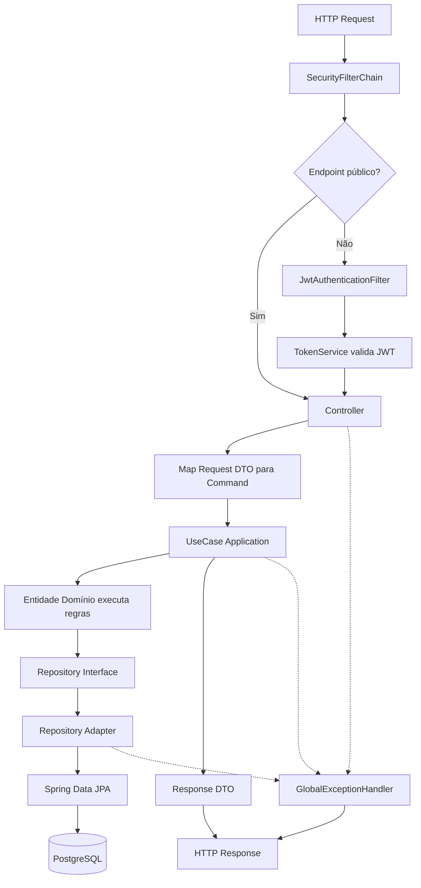

# Backend Spring Boot — Explicação de Workflow (Clean Architecture)

## 1) Visão geral em linguagem simples

Este backend está organizado em **módulos de negócio** e em **camadas** para manter separação de responsabilidade:

- `identity` → tudo sobre utilizador, registo, login e perfil.
- `knowledge` → tudo sobre desafios de código e snippets.
- `shared` → segurança JWT, tratamento global de erros e configurações comuns.

Em cada módulo (`identity` e `knowledge`) existe um padrão de camadas que segue a ideia da Clean Architecture:

- **presentation**: controllers e DTOs de entrada/saída HTTP.
- **application**: casos de uso (regras de fluxo) e ports/interfaces.
- **domain**: entidades de negócio puras e contratos de repositório.
- **infrastructure**: implementação técnica (JPA, Spring Data, JWT, BCrypt).

Regra principal: as camadas mais internas (domain/application) não dependem de detalhes de framework.

---

## 2) Fluxo padrão de uma requisição

Quase todas as requisições seguem este caminho:

1. **Controller** recebe request HTTP e valida com `@Valid`.
2. Controller converte request para um **Command** (DTO da aplicação).
3. Controller chama um **UseCase**.
4. UseCase executa regra de negócio usando entidades do domínio.
5. UseCase chama um **Repository (interface do domínio)**.
6. **Adapter de infraestrutura** implementa esse repository usando Spring Data JPA.
7. Adapter mapeia entre **entidade de domínio** e **entidade JPA**.
8. Resposta volta como DTO de aplicação e o Controller devolve HTTP status adequado.

Quando há erro, o `GlobalExceptionHandler` transforma exceções em respostas padronizadas.

---

## 3) Segurança (JWT) no início do pipeline

Antes de chegar aos controllers protegidos, a aplicação passa pelo filtro JWT:

- `SecurityConfig` define endpoints públicos (`POST /users`, `POST /auth/login`, `GET /challenges/user/*`, docs) e exige autenticação no restante.
- `JwtAuthenticationFilter` lê o header `Authorization: Bearer <token>`.
- O filtro usa `TokenService` (implementado por `JwtTokenAdapter`) para validar token e extrair o `subject`.
- Esse `subject` é o `UUID` do utilizador e vira `authentication.getName()`.
- Nos controllers, esse `UUID` é convertido para `UUID.fromString(...)`.

Resultado: casos de uso recebem o `requesterId`/`authorId` sem acoplamento direto ao JWT.

---

## 4) Workflow do módulo Identity

### 4.1 Registar utilizador — `POST /api/v1/users`

- `UserController.registerUser` recebe `RegisterUserRequest`.
- Converte para `RegisterUserCommand`.
- `RegisterUserUseCase`:
  - verifica unicidade de email e username (`existByEmail`, `existByUsername`);
  - faz hash da password via `PasswordHasher` (adapter BCrypt);
  - cria `User` (domínio), define timestamps e salva;
  - retorna `UserProfileResponse`.
- Controller devolve `201 Created` com header `Location`.

### 4.2 Login — `POST /api/v1/auth/login`

- `AuthController.login` recebe `LoginRequest`.
- Converte para `LoginCommand` e chama `AuthenticateUserUseCase`.
- UseCase:
  - busca user por email;
  - valida password com `passwordHasher.matches(...)`;
  - gera token com `TokenService.generateToken(...)`.
- Resposta retorna `TokenResponse` com JWT.

### 4.3 Ver perfil autenticado — `GET /api/v1/users/me`

- Controller lê `authentication.getName()` (UUID no token).
- `GetProfileUseCase` busca utilizador e devolve dados de perfil.

### 4.4 Alterar visibilidade do perfil — `PATCH /api/v1/users/me`

- Controller envia `UpdateProfileVisibilityCommand`.
- `UpdateProfileVisibilityUseCase` busca user e chama comportamento do domínio:
  - `makeProfilePublic()` ou `makeProfilePrivate()`.
- Depois persiste.

---

## 5) Workflow do módulo Knowledge (desafios)

### 5.1 Criar desafio — `POST /api/v1/challenges`

- `ChallengeController.submitChallenge` pega `authorId` do token.
- Mapeia request para `SubmitChallengeCommand` e lista de `SnippetCommand`.
- `SubmitChallengeUseCase`:
  - cria `Challenge` (privado por padrão);
  - atualiza métricas (`time/space/aiAutonomyIndex`);
  - cria `Snippet` para cada item e adiciona ao challenge;
  - salva no repository.
- Retorna `201 Created`.

### 5.2 Listar meus desafios — `GET /api/v1/challenges`

- Controller pega `authorId` autenticado.
- `ListMyChallengesUseCase` busca todos os desafios do autor e retorna resumo.

### 5.3 Alterar visibilidade do desafio — `PATCH /api/v1/challenges/{id}/visibility`

- UseCase busca desafio.
- Regra de autorização: só o autor pode alterar.
- Chama `publish()` ou `unpublish()` no domínio e salva.

### 5.4 Ver detalhe do desafio — `GET /api/v1/challenges/{id}`

- UseCase busca desafio por id.
- Regra de autorização:
  - pode ver se for dono, **ou** se o desafio for público.
- Monta `ChallengeDetailResponse` com snippets.

### 5.5 Listar desafios públicos de um autor — `GET /api/v1/challenges/user/{authorId}`

- Endpoint público.
- UseCase usa query específica para trazer só desafios públicos do autor.

---

## 6) Encapsulamento: por que está assim?

### Entidades de domínio com comportamento

As regras principais ficam no domínio (`User`, `Challenge`, `Snippet`):

- validações de consistência (`title` obrigatório, email válido, faixa de índice IA 1..5 etc.);
- ações de negócio (`publish`, `unpublish`, `makeProfilePublic`, `addSnippet`);
- atualização de `updatedAt` dentro da própria entidade.

Isto evita “regra espalhada” em controllers/services e reduz bugs.

### Coleção protegida com `Collections.unmodifiableList`

`Challenge.getSnippets()` devolve lista imutável. Assim código externo não consegue fazer:

- adicionar/remover snippets sem passar por `addSnippet`;
- quebrar regra de atualização de `updatedAt`.

### Ports e adapters

No `application`, dependências técnicas entram como interfaces (`PasswordHasher`, `TokenService`).

Vantagens:

- troca de implementação sem mexer na regra (ex.: trocar JWT lib, trocar BCrypt);
- facilidade de teste unitário com mocks/fakes;
- menor acoplamento com Spring ou banco.

### Repository de domínio + adapter JPA

UseCase conhece apenas `UserRepository`/`ChallengeRepository` (contratos).
Quem conhece JPA é o adapter (`UserRepositoryAdapter`, `ChallengeRepositoryAdapter`).

Isso mantém o domínio limpo e independente de persistência.

---

## 7) Tratamento de erros e contrato HTTP

`GlobalExceptionHandler` mapeia exceções para respostas padronizadas (`ProblemDetail`):

- `IllegalArgumentException` → `400 Bad Request`.
- `IllegalStateException` → `409 Conflict`.
- erro de validação de payload (`MethodArgumentNotValidException`) → `400` com lista de campos inválidos.
- fallback genérico → `500 Internal Server Error`.

Assim os controllers ficam mais limpos e a API mantém padrão consistente.

---

## 8) Fluxograma (Mermaid)

---

## 9) UML simplificada de camadas e dependências

```mermaid
classDiagram
    class AuthController
    class UserController
    class ChallengeController

    class AuthenticateUserUseCase
    class RegisterUserUseCase
    class GetProfileUseCase
    class UpdateProfileVisibilityUseCase
    class SubmitChallengeUseCase
    class ListMyChallengesUseCase
    class ChangeChallengeVisibilityUseCase
    class GetChallengeDetailUseCase
    class ListPublicChallengesByAuthorUseCase

    class User
    class Challenge
    class Snippet

    class UserRepository
    class ChallengeRepository
    class PasswordHasher
    class TokenService

    class UserRepositoryAdapter
    class ChallengeRepositoryAdapter
    class BcryptPasswordHasherAdapter
    class JwtTokenAdapter
    class SpringDataUserRepository
    class SpringDataChallengeRepository

    AuthController --> AuthenticateUserUseCase
    UserController --> RegisterUserUseCase
    UserController --> GetProfileUseCase
    UserController --> UpdateProfileVisibilityUseCase
    ChallengeController --> SubmitChallengeUseCase
    ChallengeController --> ListMyChallengesUseCase
    ChallengeController --> ChangeChallengeVisibilityUseCase
    ChallengeController --> GetChallengeDetailUseCase
    ChallengeController --> ListPublicChallengesByAuthorUseCase

    AuthenticateUserUseCase --> UserRepository
    AuthenticateUserUseCase --> PasswordHasher
    AuthenticateUserUseCase --> TokenService

    RegisterUserUseCase --> UserRepository
    RegisterUserUseCase --> PasswordHasher
    GetProfileUseCase --> UserRepository
    UpdateProfileVisibilityUseCase --> UserRepository

    SubmitChallengeUseCase --> ChallengeRepository
    ListMyChallengesUseCase --> ChallengeRepository
    ChangeChallengeVisibilityUseCase --> ChallengeRepository
    GetChallengeDetailUseCase --> ChallengeRepository
    ListPublicChallengesByAuthorUseCase --> ChallengeRepository

    UserRepositoryAdapter ..|> UserRepository
    ChallengeRepositoryAdapter ..|> ChallengeRepository
    BcryptPasswordHasherAdapter ..|> PasswordHasher
    JwtTokenAdapter ..|> TokenService

    UserRepositoryAdapter --> SpringDataUserRepository
    ChallengeRepositoryAdapter --> SpringDataChallengeRepository

    RegisterUserUseCase --> User
    UpdateProfileVisibilityUseCase --> User
    SubmitChallengeUseCase --> Challenge
    SubmitChallengeUseCase --> Snippet
    ChangeChallengeVisibilityUseCase --> Challenge
    GetChallengeDetailUseCase --> Challenge
```

---

